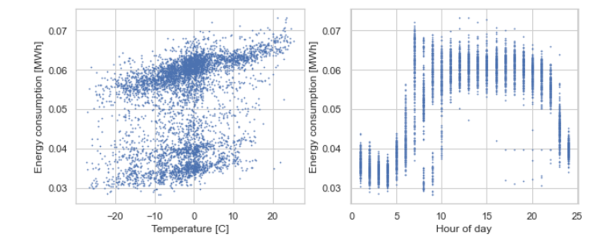
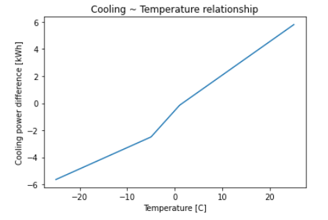
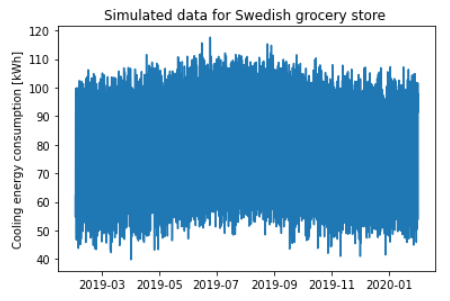

## Total energy use
* Coop size: Full building ~6000 m<sup>2</sup>. This also includes a small coffee shop, betting shop, etc. These will probably have a lower energy usage per m<sup>2</sup>, since they won't need as much cooling.  
(Store only ~4600 m<sup>2</sup> (https://www.facebook.com/234295273366350/posts/3475854752543703/))
* Swedish grocery store electricity usage, excluding electricity direct heating: ~309 kWh/m<sup>2</sup> (from "Energianvändning i handelslokaler", Energimyndigheten, 2010, using a small sample of comparable size store data from 2009)

6000 * 309 = 1 854 000 kWh

Assuming some energy efficiency improvements since 2009, and also taking into account the fact that some of the 6000 m<sup>2</sup> are made up of other retail units, with lower freezing and cooling needs, we proceed with a guesstimate for the total yearly energy consumption of 1550 MWh.

## Share of total energy that goes towards cooling

In Energimyndigheten's report (https://energimyndigheten.a-w2m.se/FolderContents.mvc/Download?ResourceId=104215), it is stated that a grocery store on average spends 47% of their energy on cooling. This will obviously vary over time though: For example on warmer days, this will be higher, and during opening hours, energy spent on lighting will be lower, etcetera. We will now attempt to model the hourly energy consumption on cooling, keeping in mind that the total for a full year should sum to roughly 47% of 1550 MWh, i.e. 728.5 MWh.

## Hourly energy consumption - cooling

We have started from the following data set:

> Leinonen, Eetu; Kiljander, Jussi; Känsälä, Klaus; Rehu, Jari; Palosaari, Jari (2019),
“Power consumption measurements in Finnish grocery stores”,
Mendeley Data, V1, doi: 10.17632/myyf72mpw9.1

Data set available at: https://data.mendeley.com/datasets/myyf72mpw9/1, we have used "Store 1".

This data set describes the electricity consumption mix for a Finnish grocery store with "older" technology for a October 2017 - June 2018 period.
Variables:

* Time - time of the measurement
* fuel_station - power consumption of the fuel station by the grocery store
* refrigerators - power usage of the refrigerators in the store
* freezers - power usage of the freezers in the store
* hvac - hvac system power usage
* sub1, sub2 - other submeterings from the store
* total - total power consumption of the store

Modifications to simulate hypothetical Swedish grocery store in 2019:

1. The Finnish data set is studied and prepared to fit prediction models for various types of grocery store electricity consumption as dependent/target.
2. The predictive models are used to predict a new simulated data set with 2019 year's calendar effects (except holidays) and Sweden's outside temperatures as features.
3. The simulated data set is rescaled to accommodate an annual electricity consumption for the hypothetical Swedish grocery store.
4. A local PV energy production simulation is added to the store model, reducing the hourly net electricity consumption needs.
5. A refrigeration-based waste heat model is added to the store model, providing a potential for waste heat export.

## Regression model for hourly consumption - cooling

First, we define cooling as the sum of "refrigerators" and "freezers" in this dataset. The store's energy consumption on cooling can be pretty well explained using the hour of day and the external temperature:



It appears that the "hour_of_day" pattern is significantly different on weekends, with a lot less power needed in the morning (which is the small cluster around x=9, y=0.03 in the right-hand plot above).

We end up with the following model:

```
                            OLS Regression Results                            
==============================================================================
Dep. Variable:                cooling   R-squared:                       0.926
Model:                            OLS   Adj. R-squared:                  0.925
Method:                 Least Squares   F-statistic:                     1495.
Date:                Wed, 14 Apr 2021   Prob (F-statistic):               0.00
Time:                        10:55:41   Log-Likelihood:                -12214.
No. Observations:                4818   AIC:                         2.451e+04
Df Residuals:                    4777   BIC:                         2.478e+04
Df Model:                          40                                         
Covariance Type:            nonrobust                                         
=======================================================================================================================
                                                          coef    std err          t      P>|t|      [0.025      0.975]
-----------------------------------------------------------------------------------------------------------------------
C(hour_of_day)[1]                                      37.8003      0.234    161.401      0.000      37.341      38.259
C(hour_of_day)[2]                                      36.6342      0.236    155.480      0.000      36.172      37.096
C(hour_of_day)[3]                                      35.8330      0.236    151.988      0.000      35.371      36.295
C(hour_of_day)[4]                                      35.4037      0.236    149.748      0.000      34.940      35.867
C(hour_of_day)[5]                                      39.4151      0.237    166.627      0.000      38.951      39.879
C(hour_of_day)[6]                                      45.0499      0.276    163.294      0.000      44.509      45.591
C(hour_of_day)[7]                                      63.7070      0.276    230.928      0.000      63.166      64.248
C(hour_of_day)[8]                                      54.0676      0.275    196.500      0.000      53.528      54.607
C(hour_of_day)[9]                                      59.7184      0.274    218.057      0.000      59.181      60.255
C(hour_of_day)[10]                                     59.2174      0.251    236.183      0.000      58.726      59.709
C(hour_of_day)[11]                                     61.6894      0.252    245.145      0.000      61.196      62.183
C(hour_of_day)[12]                                     61.7679      0.250    246.892      0.000      61.277      62.258
C(hour_of_day)[13]                                     61.3738      0.234    262.525      0.000      60.915      61.832
C(hour_of_day)[14]                                     61.5344      0.234    262.937      0.000      61.076      61.993
C(hour_of_day)[15]                                     61.6013      0.234    263.487      0.000      61.143      62.060
C(hour_of_day)[16]                                     61.5270      0.233    263.520      0.000      61.069      61.985
C(hour_of_day)[17]                                     61.6801      0.234    263.980      0.000      61.222      62.138
C(hour_of_day)[18]                                     61.8731      0.234    264.494      0.000      61.414      62.332
C(hour_of_day)[19]                                     61.2979      0.234    262.302      0.000      60.840      61.756
C(hour_of_day)[20]                                     60.6502      0.249    243.238      0.000      60.161      61.139
C(hour_of_day)[21]                                     59.9944      0.249    240.614      0.000      59.506      60.483
C(hour_of_day)[22]                                     56.7308      0.234    242.290      0.000      56.272      57.190
C(hour_of_day)[23]                                     46.2516      0.235    196.958      0.000      45.791      46.712
C(hour_of_day)[24]                                     41.1577      0.235    175.213      0.000      40.697      41.618
I(day_of_week == 5)[T.True]                             0.3175      0.127      2.505      0.012       0.069       0.566
I((day_of_week == 6) & (hour_of_day == 6))[T.True]     -5.1709      0.626     -8.266      0.000      -6.397      -3.945
I((day_of_week == 6) & (hour_of_day == 7))[T.True]     -8.8784      0.626    -14.193      0.000     -10.105      -7.652
I((day_of_week == 6) & (hour_of_day == 8))[T.True]      1.9546      0.626      3.125      0.002       0.728       3.181
I((day_of_week == 6) & (hour_of_day == 9))[T.True]      2.3048      0.625      3.687      0.000       1.079       3.530
I((day_of_week == 7) & (hour_of_day == 6))[T.True]     -5.0031      0.625     -7.999      0.000      -6.229      -3.777
I((day_of_week == 7) & (hour_of_day == 7))[T.True]    -19.4431      0.625    -31.087      0.000     -20.669     -18.217
I((day_of_week == 7) & (hour_of_day == 8))[T.True]    -18.6275      0.625    -29.783      0.000     -19.854     -17.401
I((day_of_week == 7) & (hour_of_day == 9))[T.True]    -24.3981      0.625    -39.031      0.000     -25.624     -23.173
I((day_of_week == 7) & (hour_of_day == 10))[T.True]   -14.4085      0.616    -23.400      0.000     -15.616     -13.201
I((day_of_week == 7) & (hour_of_day == 11))[T.True]    -4.1997      0.617     -6.812      0.000      -5.408      -2.991
I((day_of_week == 7) & (hour_of_day == 12))[T.True]    -2.2618      0.616     -3.672      0.000      -3.469      -1.054
I((day_of_week == 7) & (hour_of_day == 20))[T.True]    -3.6500      0.616     -5.928      0.000      -4.857      -2.443
I((day_of_week == 7) & (hour_of_day == 21))[T.True]    -5.3111      0.616     -8.625      0.000      -6.518      -4.104
temperature_undr_n5                                     0.1573      0.013     12.492      0.000       0.133       0.182
temperature_betw_n5_1                                   0.3904      0.023     16.661      0.000       0.344       0.436
temperature_over_1                                      0.2481      0.016     15.515      0.000       0.217       0.279
==============================================================================
Omnibus:                     2921.943   Durbin-Watson:                   0.947
Prob(Omnibus):                  0.000   Jarque-Bera (JB):            94470.120
Skew:                          -2.355   Prob(JB):                         0.00
Kurtosis:                      24.176   Cond. No.                         145.
==============================================================================

Notes:
[1] Standard Errors assume that the covariance matrix of the errors is correctly specified.
```

Using this model, the residuals take a decent normal distribution.

The temperature vs consumption relationship is described by a piecewise linear polynomial, and it comes out like this:



We note that this Finnish temperature data is slightly lower than the Vetelängden temperatures, and it is possible that the "true" cooling ~ temperature relationship should increase more for higher temperatures. We will overlook this for now.

### Generating mock data for Sweden 2019

Plugging in the temperature readings from Vetelängden and calendar effects for the 12 month period 2019-02-01 - 2020-02-01, we predict energy consumption for cooling, and scale it as described in the intro. We then generate mock data:

energy_cooling_mock = max(0, energy_cooling_pred + epsilon)

where epsilon ~ N(0, s2), where s is the standard deviation of the residuals in the linear regression model. Doing "max(0, ...)" is just to safeguard against generating negative data, which obviously wouldn't make sense. The risk of this is very small though. A generated mock data series can look like this: 

