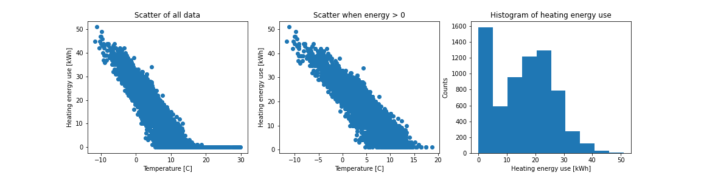
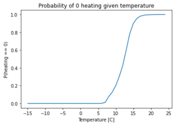

# Heating demand
Heating demand will naturally be very correlated with outside temperature.

We use the data we have, from Tornet's Vetelängden buildings.
This is of course a residential building, but our idea is that the general relationship of heating ~ temperature should be fairly similar.

## Comfort heating
The data from Vetelängden looks like this:

We see that there is a clear linear relationship between temperature and heating energy use, truncated at 0 heating.
Based on this, we will use a mix of two models:
A binomial generalized linear model for whether (heating == 0), and then a simple OLS linear regression for heating given that heating > 0.

The latter is easily estimated, _y = alpha + beta * x_ where _y_ is the heating energy use, _x_ the temperature, and _alpha_ and _beta_ are coefficients.

The former has a slightly more complex relationship with temperature, piecewise linear, resulting in the following graph:

With these models, we can simulate mock data.
For each time step _t_, we first use the binomial model to simulate whether the heating energy use should be 0.
If not, we go on and use the OLS model to simulate a heating energy use value, truncated at 0.
(Note: with this approach it is possible that the "heating-given-that-heating-is-non-zero" actually is simulated as 0,
so we will get a slight over-representation of 0s.
But since this is just a crude model to generate mock data, we will ignore this flaw.)

For some buildings, we may also want to adjust the heating demand based on expected opening times. 

## Hot water
Since this post is so small for non-residential buildings, we will be content with a rough estimate:
We will assume a uniform usage whenever the store/office/etc. is open, and add some noise to this.
The noise is added by multiplying the uniform usage with a normally distributed random variable, with mean 1 and standard deviation 0.2.