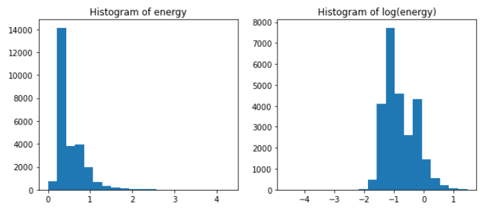
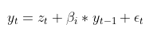
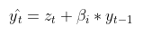
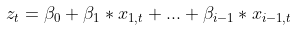
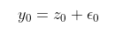
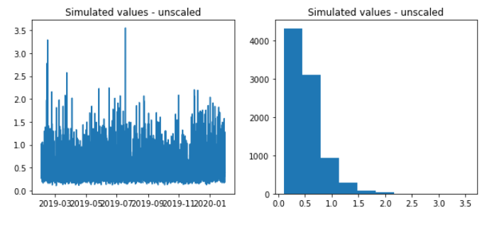

For household electricity, we have no data from Vetelängden, since this data is the property of the electricity provider and not Tornet. Instead, we will have to mock it, starting from some other data.

Current simulation model starts out with a modified version of the following data set:

> Makonin, Stephen, 2018, "HUE: The Hourly Usage of Energy Dataset for Buildings in British Columbia", 
https://doi.org/10.7910/DVN/N3HGRN, 
Harvard Dataverse, V5, UNF:6:F2ursIn9woKDFzaliyA5EA== [fileUNF] 

Data set available at: https://dataverse.harvard.edu/dataset.xhtml?persistentId=doi:10.7910/DVN/N3HGRN

This data set contains individual household's metered hourly household electricity consumption. The available collection of 28 different residential units are all located in British Columbia, Canada, and local weather station data is provided as well.

Based on the data set documentation of 1) type of residential unit (we ideally prefer "apartment" or possibly "modern", where the latter is two- or three-level houses built in 1990s and onward), 2) HVAC solution (we do not want electrical heating or AC as a major part of the aggregate reading) plus our interest in 3) length of the data series (we want at least 1 year and prefer maximum) we select the anonymized household series "Residential_12". This sub-set includes following specifications:

* Period: 2015-02-21 - 2018-02-20 (hourly)
* House Type: "apartment"
* HVAC: "NAC" = no air-conditioning, "IFRHG" = in-floor radiant heating (gas boiler)
* Region: "YVR" = Vancouver and Lower Mainland Area

Variables:

* date - YYYY-MM-DD
* hour - HH
* energy_kWh - aggregate electricity metering from grid owner BCHydro

Supporting local weather station variables include:

* temperature - outside temperature in Celsius

Modifications to simulate hypothetical Swedish residential electricity profile in 2019:

1. The full 2015-2018 data set is studied and prepared to fit prediction models for various types of residential hourly electricity consumption patterns as dependent/target.
2. The predictive models are used to predict a new simulated data set with 2019 year's calendar effects and Sweden's outside temperatures as features.
3. The simulated data set is rescaled to accommodate an annual electricity consumption for the hypothetical Swedish residential units.

## Model
We have made some attempts to model this data using Facebook's Prophet, but with little success - one reason for this is that we have hourly data with high variability from one hour to the next, for example sudden spikes around 8:00 and 19:00. Prophet's Fourier series tries to smooth these out too much, we think.

Instead, we have gone with a simple linear regression model, but first log-transformed the data, since it is non-negative. Histograms:



As we can see, the distribution isn't great after log-transformation, we would have liked it to be more normally distributed. We might revisit this to improve the mock-up.

Using residual plots etc we arrive at the following linear model:

```
                            OLS Regression Results                            
==============================================================================
Dep. Variable:             log_energy   R-squared:                       0.706
Model:                            OLS   Adj. R-squared:                  0.705
Method:                 Least Squares   F-statistic:                     1018.
Date:                Mon, 19 Apr 2021   Prob (F-statistic):               0.00
Time:                        10:15:46   Log-Likelihood:                -2863.2
No. Observations:               18270   AIC:                             5814.
Df Residuals:                   18226   BIC:                             6158.
Df Model:                          43                                         
Covariance Type:            nonrobust                                         
=================================================================================================================================================================
                                                                                                    coef    std err          t      P>|t|      [0.025      0.975]
-----------------------------------------------------------------------------------------------------------------------------------------------------------------
Intercept                                                                                        -1.2478      0.029    -42.307      0.000      -1.306      -1.190
np.isnan(energy_prev)[T.True]                                                                     0.6939      0.058     11.884      0.000       0.579       0.808
C(month_of_year)[T.2]                                                                            -0.0402      0.010     -3.853      0.000      -0.061      -0.020
C(month_of_year)[T.3]                                                                            -0.0834      0.010     -8.204      0.000      -0.103      -0.063
C(month_of_year)[T.4]                                                                            -0.0726      0.011     -6.544      0.000      -0.094      -0.051
C(month_of_year)[T.5]                                                                            -0.0468      0.011     -4.260      0.000      -0.068      -0.025
C(month_of_year)[T.6]                                                                            -0.0713      0.011     -6.419      0.000      -0.093      -0.050
C(month_of_year)[T.7]                                                                            -0.0654      0.011     -5.934      0.000      -0.087      -0.044
C(month_of_year)[T.8]                                                                            -0.0571      0.011     -5.163      0.000      -0.079      -0.035
C(month_of_year)[T.9]                                                                            -0.0390      0.011     -3.523      0.000      -0.061      -0.017
C(month_of_year)[T.10]                                                                           -0.0593      0.011     -5.398      0.000      -0.081      -0.038
C(month_of_year)[T.11]                                                                           -0.1217      0.011    -10.966      0.000      -0.143      -0.100
C(month_of_year)[T.12]                                                                           -0.0284      0.010     -2.715      0.007      -0.049      -0.008
I((day_of_week <= 5) & ( ~major_holiday) & (hour_of_day == 1))[T.True]                           -0.0331      0.013     -2.469      0.014      -0.059      -0.007
I((day_of_week <= 5) & ( ~major_holiday) & (hour_of_day <= 6))[T.True]                           -0.2231      0.006    -35.102      0.000      -0.236      -0.211
I((day_of_week <= 5) & ( ~major_holiday) & (hour_of_day == 7))[T.True]                           -0.0390      0.012     -3.240      0.001      -0.063      -0.015
I((day_of_week <= 5) & ( ~major_holiday) & (hour_of_day == 8))[T.True]                            0.4064      0.012     33.837      0.000       0.383       0.430
I((day_of_week <= 5) & ( ~major_holiday) & (hour_of_day == 9))[T.True]                            0.0401      0.012      3.320      0.001       0.016       0.064
I((day_of_week <= 5) & ( ~major_holiday) & (hour_of_day == 10))[T.True]                          -0.1808      0.012    -14.915      0.000      -0.205      -0.157
I((day_of_week <= 5) & ( ~major_holiday) & (hour_of_day == 11))[T.True]                          -0.4615      0.012    -38.296      0.000      -0.485      -0.438
I((day_of_week <= 5) & ( ~major_holiday) & (hour_of_day >= 12) & (hour_of_day <= 17))[T.True]    -0.1192      0.006    -19.553      0.000      -0.131      -0.107
I((day_of_week <= 5) & ( ~major_holiday) & (hour_of_day == 18))[T.True]                           0.0189      0.012      1.566      0.117      -0.005       0.043
I((day_of_week <= 5) & ( ~major_holiday) & (hour_of_day == 19))[T.True]                           0.2706      0.012     22.464      0.000       0.247       0.294
I((day_of_week <= 5) & ( ~major_holiday) & (hour_of_day == 20))[T.True]                           0.1002      0.012      8.296      0.000       0.077       0.124
I((day_of_week <= 5) & ( ~major_holiday) & (hour_of_day == 21))[T.True]                          -0.0413      0.012     -3.401      0.001      -0.065      -0.018
I((day_of_week <= 5) & ( ~major_holiday) & (hour_of_day == 22))[T.True]                          -0.2288      0.012    -18.923      0.000      -0.253      -0.205
I((day_of_week <= 5) & ( ~major_holiday) & (hour_of_day == 23))[T.True]                          -0.4211      0.013    -31.710      0.000      -0.447      -0.395
I((day_of_week <= 5) & ( ~major_holiday) & (hour_of_day == 24))[T.True]                          -0.3407      0.012    -28.530      0.000      -0.364      -0.317
I(((day_of_week == 5) | pre_major_holiday) & (hour_of_day == 23))[T.True]                         0.1842      0.030      6.222      0.000       0.126       0.242
I((day_of_week > 5) | major_holiday)[T.True]                                                     -0.0288      0.007     -4.148      0.000      -0.042      -0.015
I(((day_of_week > 5) | major_holiday) & (hour_of_day == 1))[T.True]                              -0.0854      0.020     -4.173      0.000      -0.125      -0.045
I(((day_of_week > 5) | major_holiday) & (hour_of_day <= 7))[T.True]                              -0.1799      0.011    -17.051      0.000      -0.201      -0.159
I(((day_of_week > 5) | major_holiday) & (hour_of_day == 9))[T.True]                               0.1007      0.020      4.986      0.000       0.061       0.140
I(((day_of_week > 5) | major_holiday) & (hour_of_day == 10))[T.True]                              0.1244      0.020      6.191      0.000       0.085       0.164
I(((day_of_week > 5) | major_holiday) & (hour_of_day == 17))[T.True]                              0.1203      0.020      6.010      0.000       0.081       0.159
I(((day_of_week > 5) | major_holiday) & (hour_of_day == 18))[T.True]                              0.1651      0.020      8.243      0.000       0.126       0.204
I(((day_of_week > 5) | major_holiday) & (hour_of_day == 19))[T.True]                              0.1953      0.020      9.722      0.000       0.156       0.235
I(((day_of_week > 5) | major_holiday) & (hour_of_day == 22))[T.True]                             -0.1295      0.020     -6.464      0.000      -0.169      -0.090
I(((day_of_week > 5) | major_holiday) & (hour_of_day == 23))[T.True]                             -0.3155      0.020    -15.745      0.000      -0.355      -0.276
I(((day_of_week > 5) | major_holiday) & (hour_of_day == 24))[T.True]                             -0.3109      0.020    -15.486      0.000      -0.350      -0.272
np.where(np.isnan(energy_prev), 0, energy_prev)                                                   0.7703      0.038     20.148      0.000       0.695       0.845
np.where(np.isnan(energy_prev), 0, np.power(energy_prev, 2))                                     -0.0977      0.012     -8.108      0.000      -0.121      -0.074
np.where(np.isnan(energy_prev), 0, np.minimum(energy_prev, 0.3))                                 -0.7073      0.112     -6.288      0.000      -0.928      -0.487
np.where(np.isnan(energy_prev), 0, np.minimum(energy_prev, 0.7))                                  1.0843      0.040     27.001      0.000       1.006       1.163
np.minimum(temperature, 5)                                                                       -0.0043      0.001     -3.127      0.002      -0.007      -0.002
==============================================================================
Omnibus:                     2677.473   Durbin-Watson:                   1.901
Prob(Omnibus):                  0.000   Jarque-Bera (JB):            34940.831
Skew:                          -0.248   Prob(JB):                         0.00
Kurtosis:                       9.757   Cond. No.                     6.19e+15
==============================================================================
```
We see that the model depends quite heavily on the reading from the previous reading, i.e. the autoregressive "AR(1)" term. 
This slightly complicates the simulation, but since all effects are additive it's not too bad.
Temperature also has an effect, with higher electricity usage for colder temperatures (linearly below 5 degrees).
However, the data source states that heating isn't included, perhaps some residents think the gas heating is inadequate and run their own electrical radiators, or something like that.

### Simulation
We now want to predict electricity usage, with this model, with Swedish major holidays instead of Canadian, and with the temperature data we have from Vetelängden.

As stated earlier, the inclusion of the AR(1) term slightly complicates the prediction process.

With y<sub>t</sub> being the energy usage at time _t_, _x<sub>j,t</sub>_ being regressor _x<sub>j</sub>_ at time _t_, _β<sub>j</sub>_ the coefficient for regressor j, and ε<sub>t</sub> the error term at time _t_ (normally distributed with 0 mean and standard deviation _s_):


(In actual fact, there are multiple terms with y<sub>t-1</sub>, but we will simplify it here). If we exclude the autoregressive term, and call this z<sub>t</sub>:


and with the "hat" signifying our estimation:


Calculating z<sub>t</sub> is straightforward:



The fact that the autoregressive term is formulated as `np.where(np.isnan(energy_prev), 0, energy_prev)` basically defines _y-1 = 0_.
Therefore, we have 


and


We generate _ε<sub>t</sub>_, and then for _t > 0_ we can calculate _y<sub>t</sub>_ step by step.

The unscaled simulated values come out as follows:



The fact that these never come real close to 0, is a consequence of the suboptimal setup of the linear model; after log-transformation the data wasn't really normally distributed.
Again, we might revisit this. However, we note that due to the fact that Jonstaka EV is really a combination of large amount of houses of varying sizes, and the number of apartments possibly totaling 2000, the household electricity usage would never really fall close to 0, it would probably be smoothed out a bit compared to the data we started from, which is just for one house.

Another note: What we're doing here is really simulating one apartment, and scaling it up massively.
However, the sum of log-normal independent random variables can be approximated by another log-normal distribution ([Wikipedia](https://en.wikipedia.org/wiki/Log-normal_distribution#Related_distributions)).

## Scaling
This data will be scaled according to the user's specifications.
The default value of 20 kWh/year/m<sup>2</sup> "Atemp" comes from a 2017-2018 metering study made by Skanska, 'Hushållsel i nybyggda flerbostadshus'.