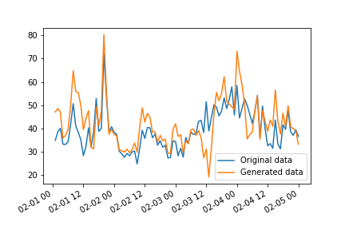

The purpose of this work is to construct some mock data for the heating of the whole Jonstaka electric village.

This attempt starts from data from Tornet's Vetelängden site, which consists of two buildings with a total of 40 apartments, according to https://www.bostadorebro.nu/CM/Templates/Article/general.aspx?cmguid=ca09bd6e-09c0-4c16-8cb2-52e2e0bf8f77.
This data has been slimmed down to a few columns: [vetelangden_slim.csv](../tradingplatformpoc/data/vetelangden_slim.csv)

We use this data, but add some noise to it, so that the data for each agent varies a bit.

The data generation is done as follows:

1. Start from the Vetelängden data
2. Every 3 hours, generate a random data point _Xt_ with _N(1, 0.22)_ distribution.
3. Between these 3 hours, interpolate _Xt_ linearly.
4. Set the mock data for this house to be the entry for Vetelängden, multiplied by _Xt_.
5. Scale the mock data according to the experiment configuration ("ResidentialSpaceHeatKwhPerYearM2" and "ResidentialHotTapWaterKwhPerYearM2")

So the un-scaled mock data will every 3 hours be different from the original Vetelängden data by a factor which is normally distributed with standard deviation 20%.
For one house, the un-scaled mock data looks like this:

